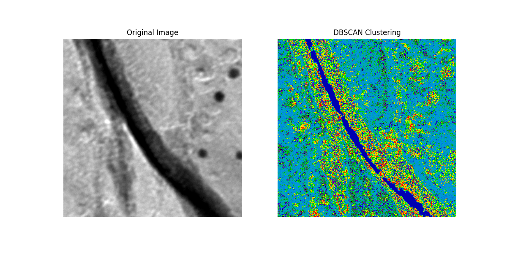
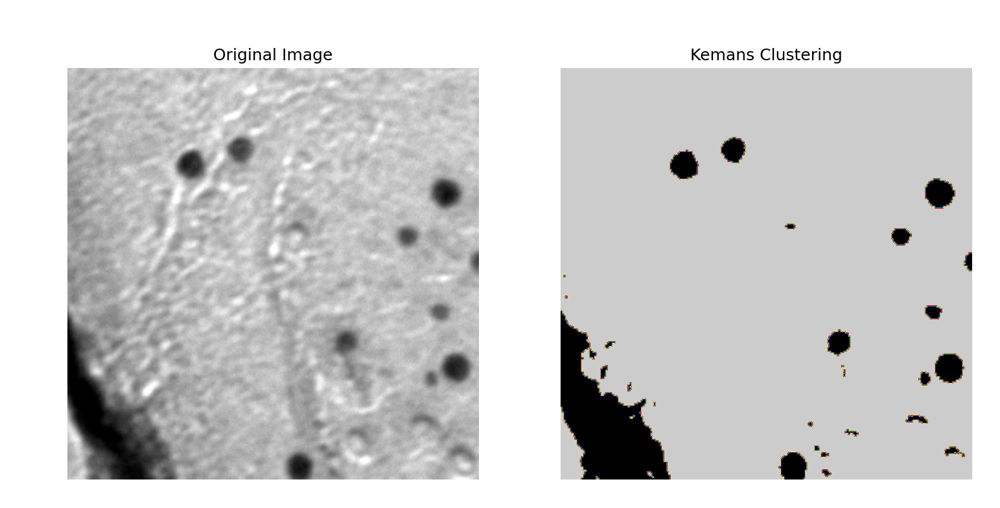
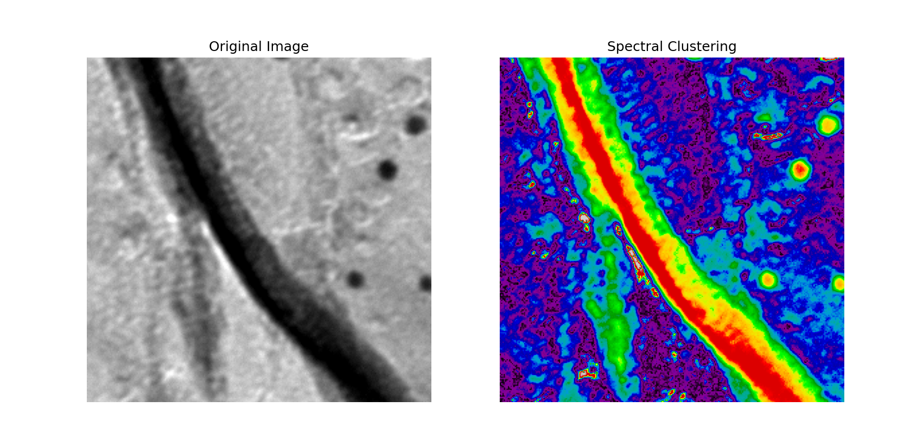

# Writeup 1 for AI in Bio Final Project. 
## 02/28/2024
### This serves primarily as notes for the required presentation and serves as good personal documentation of this project for future use.

#### Completed Tasks
Over the past day, we have been able to run 3 clustering algorithms on our image dataset. Particularly, DBSCAN, K-means for 2 groups, and OPTICS. All three of these have produced promising results, namely:
- Optics has produced incredible detail and has been able to pick immunogold particles out of noise
- Kmeans has segmented simiularly well at 2 groups and has taken much less time.

DBSCAN produces the highest fidelity images at the fastest time but where there are shadows and crevices, it struggles to pick out the immunogold particles; even when threy are very far away from a crack.

#### To-Do
The main goal of the final project could/should be comparing the efficency of these algorithms to eachother and "benchmarking" them. Maybe it would be itneresting to create a splayed panel comparing the performance of some of sklearns clustering algorithms on some of the thougher images in our dataset. This particular idea of visualization was inspired by: https://scikit-learn.org/stable/modules/clustering.html

#### Pictures of results

Segmenting using DBSCAN:

Segmenting using KMeans:

Segmenting using OPTICS: (ignore it saying spectral in the image)
